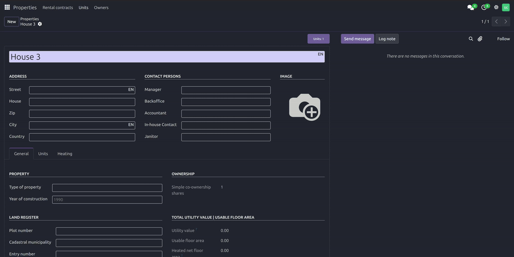

# ostwind_patrner_select_field

There is a PBX extension for the partner select field.

The ostwind_partner_select_field module is an Odoo extension designed to enhance the partner selection field by consolidating communication buttons (e.g., call, email, message) directly into the partner field. Here’s a breakdown of its benefits:

1. Odoo Architecture: Modular and Extensible Design

Modularity: Odoo’s architecture allows developers to extend or modify any component without altering the core system. This module leverages Odoo’s inheritance mechanism (e.g., extending res.partner or form views) to add functionality to the partner selection field.
Non-Intrusive: The module doesn’t require changes to Odoo’s core codebase. It uses XML inheritance to modify views and JavaScript/OWL to extend the UI, ensuring compatibility with future Odoo updates.
Reusability: The design allows the module to be reused or adapted for other fields or models, showcasing Odoo’s flexibility.

2. Extension Functionality: All Communication Buttons in One Partner Field

Streamlined UI: Instead of scattering communication buttons (call, email, message) across the interface, this module integrates them directly into the partner selection field. This reduces clutter and improves user experience.
Efficiency: Users can initiate communication actions (e.g., call, email) directly from the partner field, saving time and reducing the need to navigate to separate sections.
Contextual Actions: The buttons are context-aware, meaning they dynamically adapt based on the selected partner (e.g., calling their phone number or emailing their address).
Customizable: The module can be extended to include additional actions (e.g., WhatsApp, SMS) or tailored to specific business workflows.

## Additional Benefits

**User-Friendly**: Simplifies the workflow for sales, support, or CRM teams by centralizing communication tools.

**Consistency**: Maintains a uniform UI/UX across Odoo, as the buttons are embedded in a familiar field.

**Scalability**: The modular approach allows for easy updates or additions (e.g., integrating new communication channels).

## Use Case Example

Imagine a salesperson selecting a partner in Odoo. With this module, they can:

Select a partner from the dropdown.
Immediately call, email, or message the partner without leaving the form.
Focus on their task without switching between tabs or screens.

This design aligns with Odoo’s philosophy of simplifying complex workflows while keeping the system adaptable.

